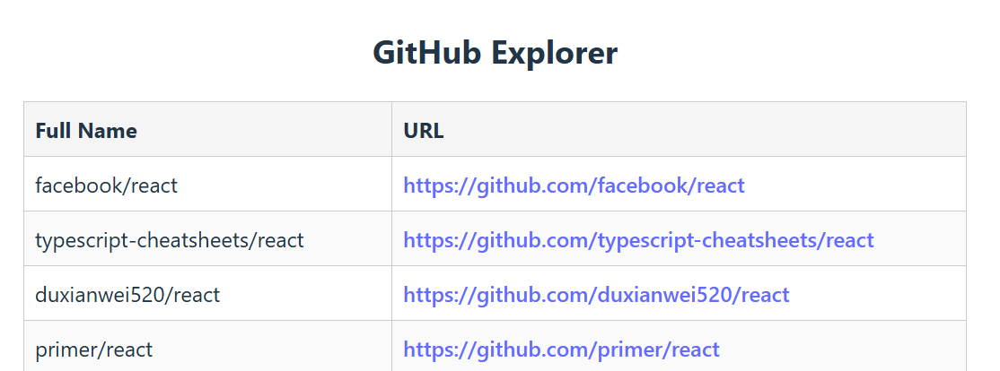
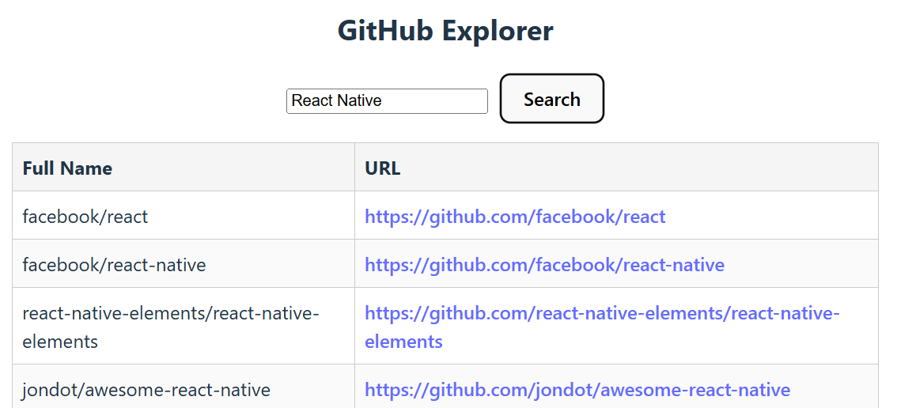

# GitHub-repositoriot

Rakenna React-sovellus, joka hakee ja näyttää julkisia repositorioita GitHubin REST API:n kautta käyttäen avainsanaa.

## Vaihe 1: Perus repositoriolista (2 pistettä)
Käytä kovakoodattua avainsanaa (react) hakeaksesi ja näyttääksesi listan GitHub-repositorioista. Haku tehdään komponentin heti kun komponentti näytetään.

Tee HTTP-pyyntö osoitteeseen:
```
https://api.github.com/search/repositories?q=react
```
Hae vastaus ja pura repositorioiden taulukko.

Näytä lista repositorioista seuraavilla tiedoilla:
- Kokonimi (esim. facebook/react)
- Klikattava URL repositorioon (html_url)

### Esimerkkituloste:



## Vaihe 2: Avainsana käyttäjän syötteestä (3 pistettä)
Salli käyttäjän syöttää oma avainsana ja hae vastaavat repositoriot GitHubista.

**Älä käytä** `useEffect`-hookkia tähän. Tapahtumankäsittelijän (kuten `onClick`) käyttäminen tässä tapauksessa yksinkertaistaa ja helpottaa koodin seuraamista.

Lisää tekstikenttä johon käyttäjä voi syöttää haussa käytettävän hakusanan. Lisää myös **Search**-painike jonka painaminen käynnistää haun.

Kun painiketta klikataan, käytä syötettyä avainsanaa fetchissä. Päivitä lista näyttämään tulokset käyttäjän haun perusteella.

Käsittele tyhjä syöte ja näytä viesti, jos avainsana puuttuu.

### Esimerkkituloste:



## Vaihe 3: Bonusvaihe (2 pistettä)
Erottele fetch-logiikka omaksi React-hookikseen uudelleenkäytettävyyden ja selkeämmän komponentin vuoksi.

Tai

Käytä jotakin fetch-kirjastoa, kuten [TanStack Query](https://tanstack.com/query/latest). Tämä tapa mahdollistaa automaattisen välimuistin, lataustilat, uudelleenyritykset jne.
