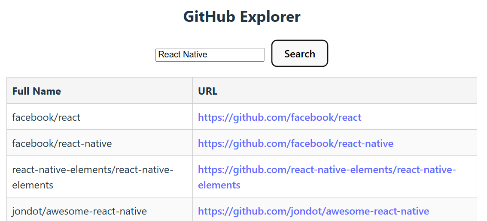

[Suomenkielinen tehtävänanto (README.fi.md)](README.fi.md)

# GitHub Repository Explorer (6 points)
Build a React application that fetches and displays public repositories from the GitHub REST API using a keyword. 

## Step 1: Basic repository list (3 points)
Use a hardcoded keyword (react) to fetch and display a list of GitHub repositories. Fetch is done on component mount.

Make HTTP request to:
```
https://api.github.com/search/repositories?q=react
```
Fetch the response and extract the repository array.

Display the list of repositories with:
- Full name (e.g., facebook/react)
- Clickable URL to the repository (html_url)

### Example output:


## Step 2: Keyword from user input (3 points)
Allow the user to enter a custom keyword and fetch matching repositories from GitHub. 

**Do NOT** use `useEffect` for this. Logic inside event handlers (like `onClick`) is easier to follow than logic using useEffect hooks with dependencies.

Add a text input and a **Search** button.

When the button is clicked use enterd keyword in fetch. Update the list to show results based on the user's search term.

Handle empty input and show a message if keyword is empty.

### Example output:



## Step 3: Bonus step (2 points)
Extract the fetch logic into a custom React hook for reusability and cleaner components.

Or

Use some fetch library such as [TanStack Query](https://tanstack.com/query/latest). This approach gives automatic caching, loading states, retries, and more.

